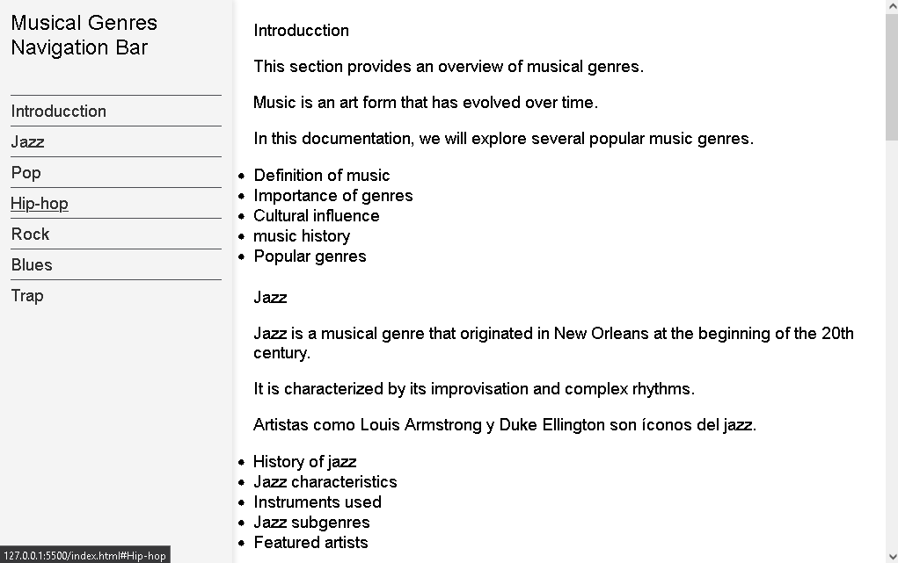

# Documentation on Musical Genres

> This is  a project of Musical Genres.

        

Additional description about the project and its features.

## Built With

- Major languages
- Frameworks
- Technologies used

## Live Demo

[Live Demo Link](https://jokerjaas2002.github.io/Documentaci-n-T-cnica/)

## Getting Started

**This code is a web page with the Digital Clock**

To get a local copy up and running follow these simple example steps.

### Prerequisites

### Setup

### Install

### Usage

### Run tests

### Deployment

## Authors

👤 **JOEL ANDRES ACOSTA SENTENO**

- GitHub: [@jokerjaas2002](https://github.com/jokerjaas2002)

🤝 Contributing
Contributions, issues, and feature requests are welcome!

Feel free to check the
[issues page](../../isuues/).

## Show your support

Give a ⭐️ if you like this project!

## Acknowledgments

- Hat tip to anyone whose code was used
- Inspiration
- etc

## 📝 License

This project is [CC0 1.0 Universal](LICENSE) licensed.git
